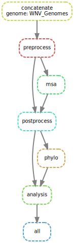
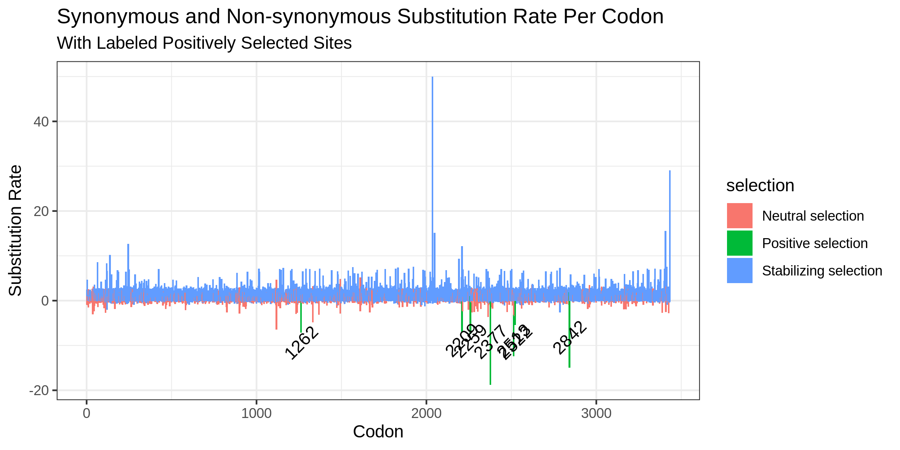

# BIOF501 Term Project: Identifying Sites of Positive Selection in West Nile Virus

### *By Fiel Dimayacyac*

--------------------

## Repository contents

### Directories

  + codon-msa: Contains scripts used in processing the reference data for codon
        aware multiple sequence alignment. 
  
  + Viral_Sequence_Data: Contains inputs for the pipeline, such as the reference
        and genomes to be analyzed.
        
  + Intermediates: Contains intermediate files used in the pipeline. 
  
  + MSA: Contains files used in aligning the genomes as well as data used when
        plotting final results.
  
  + tree: Contains the phylogenetic tree generated by FastTree.
  
  + hyphy_out: Contains final outputs for the pipeline such as a results summary
        and the final plot. 
        
  + scripts: Contains the R script used to plot the data.
  
### Files

  + dag.svg: Representation of the overall workflow in SVG format. Viewable in
        web browser. 
        
  + environment.yml: Contains dependencies used in this workflow. Used to build
        the conda environment.
        
  + Snakefile: Instructions for running the pipeline through snakemake. Can be
        configured to accept different inputs. 

---------------------

## Introduction

### Background

West Nile Virus is a mosquito-borne ssRNA (single stranded RNA) virus capable of causing
encephalitis, meningitis, comas, and even death. Subsequent recovery from encephalitis
caused by WNV is reportedly slow; less than 40% of patients report full recovery one
year post-treatment [[1](#references)]. Following the first reported case of WNV in the Western 
Hemisphere in 1999, the virus has spread throughout much of the United States and is a
growing concern in Canada [[2](#references)]. While current WNV incidence is relatively low, the amount
of cases in steadily growing [[3](#references)]. With increasing temperatures due to global climate 
change, specifically in Canada, the vector for this virus is spreading farther and
farther north, increasing the risk of WNV spread and possible epidemic [[4](#references)]. 

Positive selection analysis of viral genomes has been previously carried out on other viruses
such as SARS-CoV-2 to identify viral adaptations and possible functional consequences of 
selected mutations [[5](#references)]. Identification of the sites being selected for can help to characterize
the changes the virus is undergoing as it further adapts to its new host: humans, and is a
good starting point to identify mutations that may be involved in increased virality of this pathogen.

This pipeline will employ the FUBAR algorithm [[6](#references)] to identify positively selected sites.
This involves calculation and comparison of posterior probabilities of two rates: the rate
of synonymous and non-synonymous mutations. Synonymous mutations comprise of mutations
which do not affect the sequence of the coded protein, whereas non-synonymous mutations
do. If the non-synonymous mutation rate (dN) is significantly greater than the synonymous
mutation rate (dS), a site can be said to be experiencing positive (diversifying) selection. 

### Purpose

This pipeline aims to identify what sites of West Nile Virus genomes are undergoing
positive selection. 

### Rationale

By identifying sites of positive selection, we may be able to identify factors related
to the adaption of this virus. Positively-selected sites are candidates to analyze when
looking for factors that may be related to virus survival and possibly, spread. 

-------------------------

## Usage

### Installation

Installing this pipeline requires conda and git. Instructions for installing these
software can be found here and here respectively. 

First, clone the repository by running the following command in a terminal:

```
git clone https://github.com/fieldima/biof501-pipeline.git

```

Next, build the conda environment by entering the following in the command line:

```
conda env create --file environment.yml
``` 

Now that it is installed, let's get to using it!

### Running the Pipeline

The pipeline is a relatively time-intensive process, depending on the amount of
sequences used, so I prefer to run it in a separate terminal window using `tmux`.

Before running the pipeline, always remember to activate the `conda` environment first
with the following command:

``` 
conda activate environment
```

The pipeline can then be run by typing in:

```
snakemake --cores 2
```

Notably, the number of cores can be changed by changing '2' to however many cores
you wish to use. 

### Pipeline Overview




A figure depicting the workflow is shown above. The workflow is broken up into 5
major steps. 

1. Concatenation of Genomes with in-frame reference file. The input files of this
pipeline include a Genomes file, containing the West Nile Virus genomes in a single
file, and a reference file containing an in-frame coding sequence. This step combines
the two files to prepare the data for selection analysis, which needs frame information. 

2. Codon aware alignment. Preprocessing, msa, and postprocessing are all included
in multiple sequence alignment of the genomes in a codon-preserving manner. Regular
alignment procedures introduce frameshift artefacts into multiple sequence alignment
data, which site-selection analysis cannot accept. This procedure converts genomes
into amino acid format, forms a MSA of the genomes using `MAFFT`, and finally converts
the information back into DNA. 

3. Building the phylogenetic tree. A phylogenetic tree is inferred from MSA data
using `FastTree` to determine evolutionary relationships between sampled West Nile
Virus genomes. 

4. Positive selection analysis. The genomes are then analyzed using a FUBAR algorithm
via `Hyphy` to determine which sites are being selected for amongst all included genomes.

5. Plotting analysis. Finally, the selection analysis is plotted via `R` using the 
`tidyverse` and `jsonlite` packages. 

### Data Used

Two files are used as inputs; *WNV_Genomes.fasta* and *Reference.fasta*. These can be
found in the Viral_Sequence_Data directory. *WNV_Genomes.fasta* includes all complete 
WNV genomes sampled in North America that are listed on [NCBI Virus](https://www.ncbi.nlm.nih.gov/labs/virus/vssi/#/virus?SeqType_s=Nucleotide&VirusLineage_ss=taxid:11082). Reference.fasta
is an in-frame coding sequence for the genome. 

The Genomes file can be altered to include or exclude different genomes to change
the search space. For example, if I wanted to search for selected sites in European
or Asian WNV variants, I would use a genomes file with only those sequences. 

Changing the reference file can alter the scope of the analysis; e.g., if you wanted
to determine if only a specific segment of the genome is under selection, like the
envelope protein, you could change the reference file to only include that sequence.

Note: The reference file *must* be in frame for the pipeline to function correctly. 

-------------------------

## Outputs and Results

### Pipeline outputs

The four outputs of this pipeline are as follows:

1. A codon-aware alignment of the genomes. This file will be of type ".msa" and
an example is provided in the MSA directory. This alignment file can be used in
other analyses such as motif-identification or can be visualized itself using tools
such as `IGV`. Notably, `Hyphy` has many other forms of analysis which make use of
codon-aware alignments.

2. A phylogenetic tree of the genomes. This will be of type "_tree" and an example
is provided in the tree directory. This can be visualized by a plethora of 
different tools, such as the R packages `geiger`, `ggtree`, and `ape`. 

3. A summary of the selection analysis. This will be of type "_FUBAR" and an example
is provided in the hyphy_out directory. This can be viewed with any text application,
such as notepad in Windows or textedit in Mac. This will outline the analysis procedure
as well as the most important results, i.e., the amount of sites with positive selection
and the codon values.

4. A plot depicting the analysis output. This will be of type ".png" and an example is
provided in the hyphy_out directory. The x-axis represents the codon position, and the
y-axis represents the substitution rate. Positive values represent the rate of synonymous
substitution whereas negative values represent the non-synonymous rate. Sites of positive
selection are labeled with their codon position for clarity. 

Note: Example data are labeled as "Example" in their respective folders.

### Results

For West Nile Virus, 7 sites were found to be under positive selection. This is shown
in the plot below. 



The sites were mostly between codon 2200 and 2500, which corresponds to proteins NS4A
and NS4B on the [West Nile Virus genome](https://www.ncbi.nlm.nih.gov/nuccore/NC_009942). 

Another notable site was codon 1262, which corresponds to NS2A.

As shown in the plot above, most sites were under purifying (negative), selection with
some sites under neutral selection. 

### Future directions

The finding that positive selection does occur on proteins NS4A and NS4B warrants a 
deeper analysis of the functional consequences of these mutations to identify possible
reasons for selection. Some preliminary analysis could include GO term identification,
functional domain annotation, etc. Another step of analysis would be to find which 
mutations are occurring on these proteins, to identify possible structural changes
occurring in these proteins. 

The pipeline itself could also be used to identify selection among different variants.
It would be interesting to see the results of this pipeline if I used a different data
set, like European or Asian WNV, to see if different areas are undergoing different
selective pressures. 

A modification of this pipeline could be to use a tool that contrasts different 
clades on this phylogeny, like MEME. That way, one could determine which sites
are undergoing positive selection in one WNV variant over another. One such example
could be contrasting selection between different host species of WNV. Do human carriers
display different selection pressures than animal vectors? 

Alternatively, this pipeline can be used to identify sites of positive selection in
other viruses, such as COVID19, by changing the input files.

An improvement of this pipeline could be to automate the process of identifying which
proteins correspond to which codon positions in the `Hyphy` output. This would need to
incorporate gene reference data and coordinates. 

----------------------

## References

[1]  Campbell, G. L., Marfin, A. A., Lanciotti, R. S., & Gubler, D. J. (2002). West Nile virus. The Lancet Infectious Diseases, 2(9), 519-529. https://doi.org/10.1016/S1473-3099(02)00368-7

[2]  Paz, S. (2015). Climate change impacts on West Nile virus transmission in a global context. Philosophical Transactions of the Royal Society B: Biological Sciences, 370(1665), 20130561. https://doi.org/10.1098/rstb.2013.0561

[3] Wijayasri, S., Nelder, M., Russell, C., Johnson, K., Johnson, S., Badiani, T., & Sider, D. (2019). West Nile virus illness in Ontario, Canada: 2017. Canada Communicable Disease Report, 44(1), 32-37. https://doi.org/10.14745/ccdr.v45i01a04

[4] Zheng, H., Drebot, M., & Coulthart, M. (2014). West Nile virus in Canada: ever-changing, but here to stay. Canada Communicable Disease Report, 40(10), 173-177. https://doi.org/10.14745/ccdr.v40i10a01

[5]  Montoya, V., McLaughlin, A., Mordecai, G. J., Miller, R. L., & Joy, J. B. (2021). Variable routes to genomic and host adaptation among coronaviruses. Journal of Evolutionary Biology, 34(6), 924-936. https://doi.org/10.1111/jeb.13771

[6] Murrell, B., Moola, S., Mabona, A., Weighill, T., Sheward, D., Kosakovsky Pond, S. L., & Scheffler, K. (2013). FUBAR: A Fast, Unconstrained Bayesian AppRoximation for Inferring Selection. Molecular Biology and Evolution, 30(5), 1196-1205. https://doi.org/10.1093/molbev/mst030
