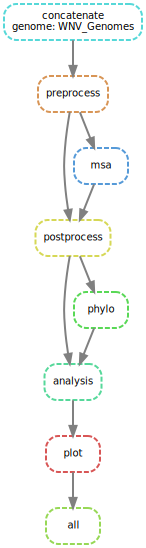

# BIOF501 Term Project: Identifying Sites of Positive Selection in West Nile Virus

## By Fiel Dimayacyac

---------------------

## Introduction

### Background

West Nile Virus is a mosquito-borne ssRNA (single stranded RNA) virus capable of causing
encephalitis, meningitis, comas, and even death. Subsequent recovery from encephalitis
caused by WNV is reportedly slow; less than 40% of patients report full recovery one
year post-treatment [1]. Following the first reported case of WNV in the Western 
Hemisphere in 1999, the virus has spread throughout much of the United States and is a
growing concern in Canada [2]. While current WNV incidence is relatively low, the amount
of cases in steadily growing [3]. With increasing temperatures due to global climate 
change, specifically in Canada, the vector for this virus is spreading farther and
farther north, increasing the risk of WNV spread and possible epidemic [4]. 

### Purpose

This pipeline aims to identify if and what sites of West Nile Virus genomes are under
positive selection.

### Rationale

By identifying sites of positive selection, we may be able to identify factors related
to the spread of this virus. Positively-selected sites are candidates to analyze when
looking for factors that may be related to virus transmission and survival. 

-------------------------

## Usage

### Installation

Installing this pipeline requires conda and git. Instructions for installing these
software can be found here and here respectively. 

First, clone the repository by running the following command in a terminal:

```
git clone https://github.com/fieldima/biof501-pipeline.git

```

Next, build the conda environment by entering the following in the command line:

```
conda env create --file environment.yml
``` 

Now that it is installed, let's get to using it!

### Running the Pipeline

The pipeline is a relatively time-intensive process, depending on the amount of
sequences used, so I prefer to run it in a separate terminal window using tmux.

Before running the pipeline, always remember to activate the conda environment first
with the following command:

``` 
conda activate environment
```

The pipeline can then be run by typing in:

```
snakemake --cores 2
```

Notably, the number of cores can be changed by changing '2' to however many cores
you wish to use. 

### Pipeline Overview




A figure depicting the workflow is shown above. The workflow is broken up into 4
major steps. 

1. Concatenation of Genomes with in-frame reference file. The input files of this
pipeline include a Genomes file, containing the West Nile Virus genomes in a single
file, and a reference file containing an in-frame coding sequence. This step combines
the two files to prepare the data for selection analysis, which needs frame information. 

2. Codon aware alignment. Preprocessing, msa, and postprocessing are all included
in multiple sequence alignment of the genomes in a codon-preserving manner. Regular
alignment procedures introduce frameshift artefacts into multiple sequence alignment
data, which site-selection analysis cannot accept. This procedure converts genomes
into amino acid format, forms a MSA of the genomes using MAFFT, and finally converts
the information back into DNA. 

3. Building the phylogenetic tree. A phylogenetic tree is inferred from MSA data
using FastTree to determine evolutionary relationships between sampled West Nile
Virus genomes. 

4. Positive selection analysis. Finally, genomes are analyzed using a FUBAR algorithm
via Hyphy to determine which sites are being selected for amongst all included genomes.

### Data Used

Two files are used as inputs; WNV_Genomes.fasta and Reference.fasta. These can be
found in the Viral_Sequence_Data directory. WNV_Genomes.fasta includes all complete 
WNV genomes sampled in North America that are listed on NCBI Virus. Reference.fasta
is an in-frame coding sequence for the genome. 

-------------------------

## Outputs and Results

----------------------

## References
